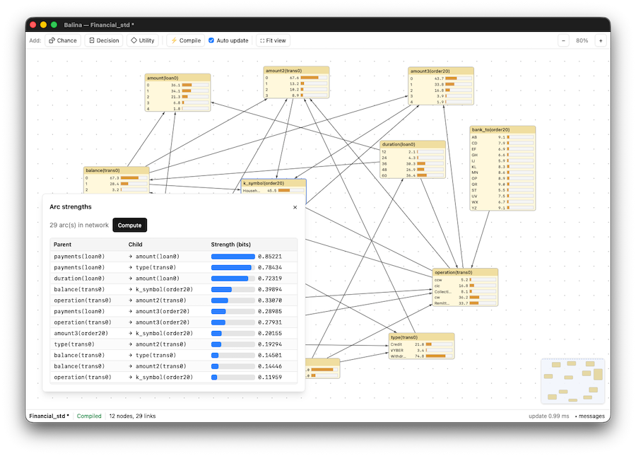

# BALINA

Bayesian And Logical Influence-diagram Network Application




## Live demos

Demos available for the WebAssembly version:

- [PISA report 2025 - Spain](https://alinatudoran.github.io/balina?file=https://raw.githubusercontent.com/alinatudoran/balina/refs/heads/master/examples/pisa_spain_2025.balina)
- [Chest Clinic](https://alinatudoran.github.io/balina?file=https://raw.githubusercontent.com/alinatudoran/balina/refs/heads/master/examples/asia.balina)
- [Umbrella (Decision & Utility nodes are used)](https://alinatudoran.github.io/balina/?file=https://raw.githubusercontent.com/alinatudoran/balina/refs/heads/master/examples/umbrella.balina)


## Features

**Editor**
- Graph Canvas: Interactive node-graph canvas.
- Node Types: Supports Chance, Decision, and Utility nodes.
- Dynamic Arc Management: Graph connection editing with real-time cycle detection and validation.
- CPT Editor: Full Conditional Probability Table editor with uniform/normalization helpers.
- Interactive Belief Bars: Visual bars displaying real-time posterior probabilities directly on node cards.

**Inference**
- Bayesian Network Inference: Exact inference powered by the Junction Tree algorithm (using min-fill triangulation and Hugin message passing).
- Evidence Handling: Supports both hard evidence and soft (likelihood) evidence, computes $P(\text{evidence})$, and detects evidence conflicts.
- Influence Diagram Evaluation: Computes expected utility across decision alternatives, exact Maximum Expected Utility (MEU), and optimal decision policies via $(p, u)$-potential Variable Elimination.

**Learning**
- Parameter Learning:
- Direct counting with Dirichlet conjugate priors.
- Expectation-Maximization (EM) for datasets containing missing observations.
- Structure Learning:
- Implements algorithms such as PC, Hill-Climbing, Tabu Search, and MMHC (Max-Min Hill-Climbing).
- Runs asynchronously in the background with progress reporting and cancellation support.

**Sensitivity & simulation**
- Sensitivity to Findings: Identifies the most informative variables using mutual information, entropy reduction, and variance reduction metrics.
- Stochastic Sampling: Forward sampling and likelihood-weighted simulation for generating synthetic datasets and case files.

**File formats**
- Native Format: .balina (human-readable JSON format).
- Standard Interchange Formats: Import and export support for XMLBIF v0.3 and GeNIe/SMILE .xdsl files (preserving layout coordinates).
- Case Data: Import/export of .csv files for learning and simulation.


## Building

**Prerequisites:** Rust (edition 2024, tested on rustc 1.95+). Node is only
needed if you change UI styles — the compiled CSS is committed and embedded,
so a plain `cargo build` works without Node.

**Linux** additionally needs the WebKit/GTK stack:
```sh
sudo apt install libwebkit2gtk-4.1-dev libgtk-3-dev libxdo-dev librsvg2-dev
```
macOS and Windows need nothing extra beyond Rust.

### Run in development

```sh
cargo run -p bn-app -- examples/asia.balina
```

### Release build

```sh
cargo build --release -p bn-app        # bare binary
```

For a desktop bundle with app icon (requires the `dx` CLI from `dioxus-cli`):

```sh
cargo install dioxus-cli               # one-time
dx bundle --release                    # run from crates/bn-app/
# output: target/dx/balina/bundle/
```

### Web (WebAssembly) build

The same app also compiles for the browser. Long-running structure learning
executes in a Web Worker; open/save become a file picker and downloads.

```sh
rustup target add wasm32-unknown-unknown                    # one-time
cargo install wasm-bindgen-cli --version 0.2.128 --locked   # one-time (version must match Cargo.lock)
sh scripts/build-worker.sh                                  # build the learning worker
cd crates/bn-app && dx serve --web --no-default-features --features web
```

For production, `dx build --release --web --no-default-features --features web`
produces a static site under `target/dx/balina/release/web/public/` that any
static file host can serve (the worker is embedded in the app wasm — no extra
files to deploy).

### Rebuild CSS (after changing Tailwind classes)

```sh
npm --prefix crates/bn-app install     # one-time
npm --prefix crates/bn-app run css
```

Commit `crates/bn-app/assets/main.css` alongside the source change — missing
classes fail silently (the element renders unstyled).

## Quick tour

1. Open `examples/asia.balina` (the classic Chest Clinic network).
2. Click the `yes` row of *Dyspnea* — every belief bar updates instantly;
   the status bar shows P(findings).
3. Right-click a node → *CPT…* to edit probabilities.
4. Tools → *Sensitivity to findings…*, pick `TbOrCa`, Run — XRay ranks first.
5. Open `examples/umbrella.balina`, then Tools → *Solve influence diagram*
   to see the optimal policy (take the umbrella iff the forecast is rainy).


## Testing

```sh
cargo test --workspace        # engine + session + UI-logic tests
```

The suite includes golden tests (Sprinkler by hand arithmetic, Asia against the published Lauritzen–Spiegelhalter values), randomized differential tests (junction tree ≡ enumeration to 1e-9 over 40 seeded random networks  with hard and soft evidence), learning-recovery tests, an influence-diagram test against brute-force policy enumeration, file round-trips for all three formats, headless op-layer tests of the session (evidence/undo cycles, CPT rollback, structure-learning staleness), and unit tests for the pure canvas core (geometry, scene projection, link validation) and dialog math.

## Workspace layout

```
crates/bn-core     engine library (model, factor algebra, inference, decisions,
                   learning, sampling, sensitivity, io) — zero GUI dependencies
crates/bn-session  application session: document + undo + engine bridge +
                   op bodies — no GUI dependency
crates/bn-app      Dioxus 0.7 app: canvas, chrome, dialogs — pure Rust;
                   compiles as a desktop app (system webview, default) and
                   as a browser app (wasm32, --features web)
crates/bn-worker   web-only: structure learning as a wasm module run in a
                   Web Worker (built by scripts/build-worker.sh)
examples/          asia.balina, umbrella.balina, asia.xmlbif, umbrella.xdsl
docs/              developer documentation (start with docs/ARCHITECTURE.md)
```


## Documentation

| Doc | Contents |
|---|---|
| [docs/ARCHITECTURE.md](docs/ARCHITECTURE.md) | workspace map, data flow, design decisions |
| [docs/ENGINE.md](docs/ENGINE.md) | bn-core internals: layout conventions, junction tree, learning, decisions |
| [docs/GUI.md](docs/GUI.md) | GUI internals: session signal, ops, dirt system, canvas, dialogs |
| [docs/FILE_FORMATS.md](docs/FILE_FORMATS.md) | `.balina` JSON, XMLBIF, XDSL, case CSVs |
| [docs/TESTING.md](docs/TESTING.md) | test suites, oracles, coverage gaps |
| [docs/DEVELOPMENT.md](docs/DEVELOPMENT.md) | commands, dependency pins, gotchas, debugging tips |
| [docs/ROADMAP.md](docs/ROADMAP.md) | known limitations and planned work with implementation hints |


## Binaries

A set of binaries for different platforms and architectures are available in the [releases](releases) page.

> [!IMPORTANT]
> macOS can claim that the downloaded app is dangerous because it was not signed by Apple. You can add the app to the list of trusted apps in the Security & Privacy settings or running the following command: 
> `xattr -cr /Applications/Balina.app`.


## Disclaimer

This software is still in Beta and it's provided "as is" without warranty of any kind.
